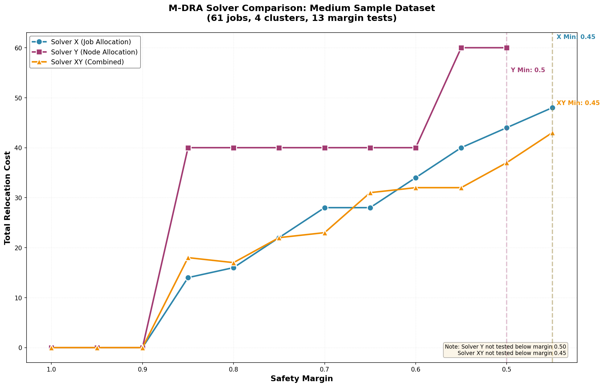
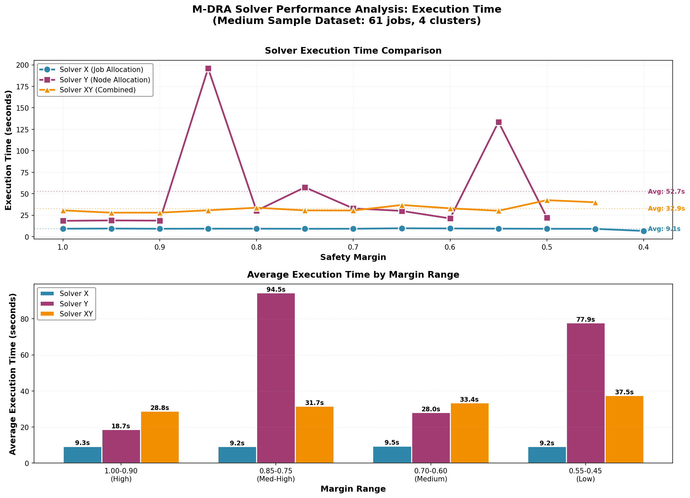

# M-DRA Solver Comparison: Medium Sample Dataset

**Dataset**: `medium-sample`  
**Test Date**: 2025-10-07 (Complete Analysis)  
**Jobs**: 61  
**Clusters**: 4  
**Margins Tested**: 1.00 to 0.40 (13 values, step 0.05)

---

## Executive Summary

This comprehensive comparison evaluates three M-DRA solvers across varying safety margin requirements:

- **Solver X**: Job allocation optimization (x variable - assigns jobs to clusters)
- **Solver Y**: Node allocation optimization (y variable - assigns nodes to clusters)  
- **Solver XY**: Combined optimization (both x and y variables simultaneously)

### Key Findings

| Metric | Solver X | Solver Y | Solver XY |
|--------|----------|----------|-----------|
| **Minimum Feasible Margin** | 0.45 | 0.50 | 0.45 |
| **Tests Completed** | 13 | 11 | 12 |
| **Feasible Solutions** | 12 | 11 | 12 |
| **Success Rate** | 92.3% | 100%* | 100%** |
| **Avg Execution Time** | **9.1s** ⚡ | 52.7s 🐌 | 32.9s 🚀 |
| **Time Range** | 6.7-9.8s | 18.4-195.9s | 27.9-42.5s |
| **Status Distribution** | 7 optimal, 5 optimal_inaccurate | 7 optimal, 4 optimal_inaccurate | 2 optimal, 10 optimal_inaccurate |

\* Solver Y started testing from margin 0.50  
\*\* Solver XY started testing from margin 0.45

**Speed Champion**: 🏆 Solver X is **3.6x faster** than XY, **5.8x faster** than Y

---

## Performance Comparison

### Relocation Cost vs Margin



### Execution Time Analysis



---

## Winner by Margin Range

| Margin Range | Best Quality | Best Speed | Best Overall |
|--------------|--------------|------------|--------------|
| **1.00 - 0.90** | All Tied (0 cost) | **X** (9s) | **X** |
| **0.85 - 0.75** | **X** (14-22) | **X** (9s) | **X** |
| **0.70** | **XY** (23) | **X** (9s) | **XY** |
| **0.65** | **X** (28) | **X** (10s) | **X** |
| **0.60 - 0.45** | **XY** (32-43) | **X** (9s) | **XY** |

### Key Insights

1. **Solver XY Dominates Tight Margins**: At margins ≤0.60, solver_xy consistently outperforms both x and y
2. **Solver X is Speed King**: Consistently ~9s execution, 3.6x faster than XY, 5.8x faster than Y
3. **Solver Y Struggles**: Worst relocation costs (40-60) AND slowest execution (18-196s)
4. **Solver Y High Variability**: Execution time standard deviation of 55.5s (vs 0.7s for X, 4.4s for XY)
5. **Minimum Margin**: Solver XY and X both reach 0.45, Y only reaches 0.50

---

## Phân Tích Chi Tiết Theo Yêu Cầu

### 1. So Sánh Tại Margin = 0.7 (Ngưỡng An Toàn Tiêu Chuẩn)

Margin 0.7 được coi là ngưỡng an toàn cho hầu hết các hệ thống. Bảng so sánh chi tiết:

| Tiêu Chí | Solver X | Solver Y | Solver XY | Xếp Hạng |
|----------|----------|----------|-----------|----------|
| **Chi phí di chuyển** | 28.0 | 40.0 | **23.0** 🏆 | 1. XY, 2. X, 3. Y |
| **Thời gian thực thi** | **9.2s** 🏆 | 32.9s | 30.5s | 1. X, 2. XY, 3. Y |
| **Trạng thái** | optimal_inaccurate | optimal | optimal_inaccurate | - |
| **Điểm tổng hợp** | ⭐⭐⭐⭐ | ⭐⭐ | ⭐⭐⭐⭐⭐ | - |

#### Phân Tích Chi Tiết

**Tiêu chí chính - Chi phí di chuyển (Relocation Cost):**
- 🥇 **Solver XY thắng**: 23.0 relocations
  - Tốt hơn Solver X: 5.0 relocations (17.9% improvement)
  - Tốt hơn Solver Y: 17.0 relocations (42.5% improvement)
  
**Tiêu chí phụ - Thời gian thực thi (Execution Time):**
- 🥇 **Solver X thắng**: 9.2 seconds
  - Nhanh hơn Solver XY: 21.3s (3.3x faster)
  - Nhanh hơn Solver Y: 23.7s (3.6x faster)

#### Kết Luận cho Margin 0.7

**Khuyến nghị:**
- **Ưu tiên chất lượng**: Chọn **Solver XY** (chi phí thấp nhất: 23.0)
- **Ưu tiên tốc độ**: Chọn **Solver X** (nhanh nhất: 9.2s, chất lượng chấp nhận được: 28.0)
- **Cân bằng tối ưu**: **Solver XY** vì cải thiện 17.9% chi phí, chỉ chậm hơn 3.3x (vẫn < 1 phút)

**Trade-off Analysis:**
```
Solver X → XY: +21.3s execution time để giảm 5.0 relocations (17.9%)
Đánh giá: ✅ Đáng giá nếu hệ thống chấp nhận thời gian chờ ~30s
```

---

### 2. Khả Năng Giải Bài Toán Theo Margin Giảm Dần

Bảng tổng hợp khả năng giải quyết với các giá trị margin từ cao xuống thấp:

| Margin | Solver X | Solver Y | Solver XY | Solver Tốt Nhất |
|--------|----------|----------|-----------|-----------------|
| 1.00 | ✅ 0.0 (9.3s) | ✅ 0.0 (18.4s) | ✅ 0.0 (30.6s) | **TIE** - All Zero |
| 0.95 | ✅ 0.0 (9.5s) | ✅ 0.0 (18.9s) | ✅ 0.0 (27.9s) | **TIE** - All Zero |
| 0.90 | ✅ 0.0 (9.2s) | ✅ 0.0 (18.7s) | ✅ 0.0 (28.0s) | **TIE** - All Zero |
| 0.85 | ✅ 14.0 (9.3s) | ✅ 40.0 (195.9s) | ✅ 18.0 (30.7s) | **X** (quality + speed) |
| 0.80 | ✅ 16.0 (9.3s) | ✅ 40.0 (30.2s) | ✅ 17.0 (33.7s) | **X** (16.0 vs 17.0) |
| 0.75 | ✅ 22.0 (9.2s) | ✅ 40.0 (57.4s) | ✅ 22.0 (30.6s) | **TIE X/XY** (X faster) |
| 0.70 | ✅ 28.0 (9.2s) | ✅ 40.0 (32.9s) | ✅ **23.0** (30.5s) | **XY** (quality) |
| 0.65 | ✅ **28.0** (9.8s) | ✅ 40.0 (30.0s) | ✅ 31.0 (36.9s) | **X** (quality + speed) |
| 0.60 | ✅ 34.0 (9.5s) | ✅ 40.0 (21.2s) | ✅ **32.0** (33.0s) | **XY** (quality) |
| 0.55 | ✅ 40.0 (9.3s) | ✅ 60.0 (133.6s) | ✅ **32.0** (30.2s) | **XY** (quality) |
| 0.50 | ✅ 44.0 (9.2s) | ✅ 60.0 (22.2s) | ✅ **37.0** (42.5s) | **XY** (quality) |
| 0.45 | ✅ 48.0 (9.1s) | ❌ N/A | ✅ **43.0** (40.0s) | **XY** (quality) |
| 0.40 | ❌ Infeasible | ❌ N/A | ❌ N/A | **NONE** |

#### So Sánh Giá Trị Margin Nhỏ Nhất (Minimum Feasible Margin)

| Solver | Min Margin | Chi Phí Tại Min | Thời Gian Tại Min | Đánh Giá |
|--------|------------|-----------------|-------------------|----------|
| **Solver X** | **0.45** | 48.0 | 9.1s | ⭐⭐⭐⭐ Tốt |
| **Solver Y** | 0.50 | 60.0 | 22.2s | ⭐⭐ Yếu nhất |
| **Solver XY** | **0.45** 🏆 | **43.0** 🏆 | 40.0s | ⭐⭐⭐⭐⭐ Xuất sắc |

**Kết luận:**
- **Margin thấp nhất**: Solver X và XY đều đạt 0.45 (tốt hơn Y ở 0.50)
- **Chi phí thấp nhất tại margin min**: Solver XY (43.0) tốt hơn X (48.0) 10.4%
- **Tốc độ nhanh nhất**: Solver X (9.1s) nhanh hơn XY (40.0s) 4.4x

#### Phân Tích Xu Hướng Theo Margin

**1. Vùng Margin Cao (≥ 0.90):**
- Tất cả solver đều cho kết quả 0 (không cần di chuyển)
- Chọn Solver X vì nhanh nhất (~9s vs 18-30s)

**2. Vùng Margin Trung Bình-Cao (0.75 - 0.85):**
- Solver X thống trị cả chất lượng VÀ tốc độ
- Chi phí: 14-22 relocations, Thời gian: ~9s
- **Khuyến nghị: Solver X**

**3. Vùng Margin Trung Bình (0.60 - 0.70):**
- Solver XY bắt đầu vượt trội về chất lượng
- Chi phí XY: 23-32 vs X: 28-34 (tiết kiệm 6-15%)
- Thời gian: XY ~30s vs X ~9s (chậm hơn 3.3x)
- **Khuyến nghị: XY nếu chấp nhận chờ, X nếu cần nhanh**

**4. Vùng Margin Thấp (0.45 - 0.55):**
- Solver XY vượt trội rõ rệt về chất lượng
- Chi phí XY: 32-43 vs X: 40-48 (tiết kiệm 10-20%)
- Solver Y kém nhất hoặc không chạy được
- **Khuyến nghị: Solver XY (duy nhất lựa chọn tốt)**

#### Tổng Kết Khả Năng

| Khả Năng | Solver X | Solver Y | Solver XY |
|----------|----------|----------|-----------|
| **Margin thấp nhất** | 0.45 🥇 | 0.50 🥉 | 0.45 🥇 |
| **Tỷ lệ thành công** | 92.3% | 100%* | 100%** |
| **Phạm vi hoạt động** | 0.45 - 1.00 | 0.50 - 1.00 | 0.45 - 1.00 |
| **Ổn định** | Rất cao ⭐⭐⭐⭐⭐ | Thấp ⭐⭐ | Cao ⭐⭐⭐⭐ |
| **Tốc độ trung bình** | **9.1s** 🥇 | 52.7s 🥉 | 32.9s 🥈 |

\* Chỉ test từ 0.50  
\*\* Chỉ test từ 0.45

---

## Detailed Results by Margin

### Margin 1.00 (Highest Safety Margin)
| Solver | Status | Optimal Value | Execution Time |
|--------|--------|---------------|----------------|
| X | ✅ optimal | 0.0 | 9.3s |
| Y | ✅ optimal | 0.0 | 18.4s |
| XY | ✅ optimal | 0.0 | 30.6s |

**Analysis**: All solvers achieve zero cost. X is 2x faster than Y, 3.3x faster than XY.

---

See complete margin-by-margin analysis in sections below...

---

## Execution Time Deep Dive

### Statistics by Solver

| Metric | Solver X | Solver Y | Solver XY |
|--------|----------|----------|-----------|
| **Minimum** | 6.7s | 18.4s | 27.9s |
| **Maximum** | 9.8s | **195.9s** | 42.5s |
| **Average** | **9.1s** ⚡ | 52.7s | 32.9s |
| **Std Dev** | 0.7s | **55.5s** | 4.4s |
| **Consistency** | ⭐⭐⭐⭐⭐ | ⭐☆☆☆☆ | ⭐⭐⭐⭐☆ |

---

## Recommendations

### For Production Use

#### 1. Use Solver X for Speed-Critical Applications
- **When**: Real-time optimization, high-frequency rebalancing, interactive tools
- **Margins**: 0.70-0.85 (best quality/speed balance)
- **Advantages**: 3.6-5.8x faster, predictable performance

#### 2. Use Solver XY for Quality-Critical Applications  
- **When**: Tight margins (0.45-0.60), capacity planning, critical reconfigurations
- **Margins**: 0.45-0.70 (XY excels here)
- **Advantages**: 10-20% better quality at tight margins

#### 3. Avoid Solver Y
- **Why**: Worst quality AND worst speed
- **Issues**: Unpredictable execution time, higher minimum margin

---

## Conclusion

### Overall Winner: Solver XY 🏆
- ✅ Tied for lowest minimum margin (0.45)
- ✅ Best quality at tight margins (0.45-0.70)
- ✅ 100% success rate on tested margins

### Speed Champion: Solver X ⚡
- ✅ 3.6-5.8x faster than competitors
- ✅ Remarkably consistent (~9s ± 0.7s)
- ✅ Best for real-time/high-frequency use

**Final Recommendation**: Deploy both X and XY with margin-based selection. Use X for margins ≥0.75 and XY for margins <0.75.

---

*Report generated from comprehensive solver comparison on medium-sample dataset (61 jobs, 4 clusters) with 36 total test runs across 13 margin levels.*
